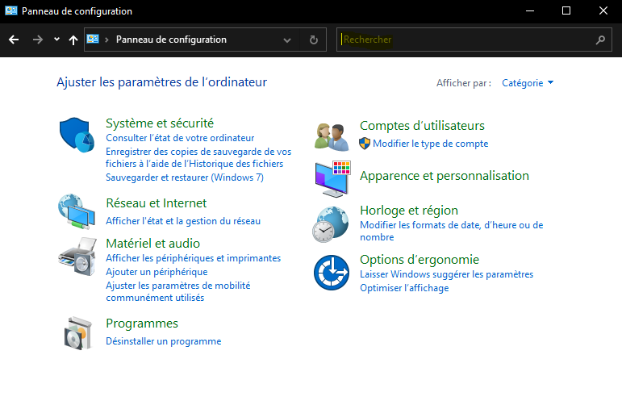
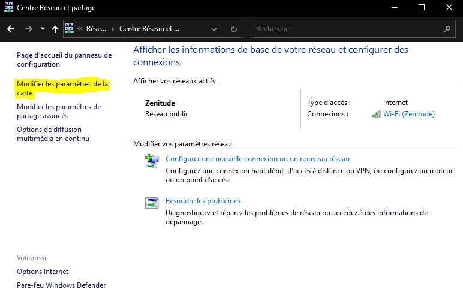
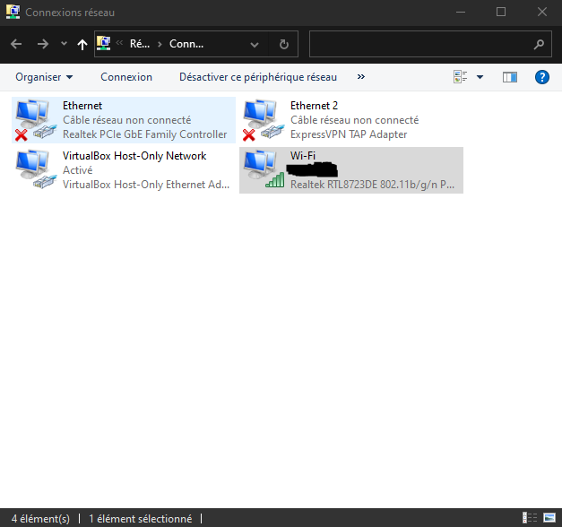
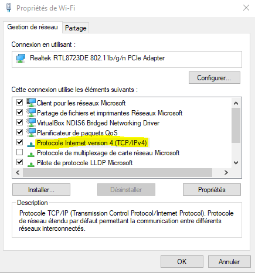

# SAE12 Réseau

<!--Hugo Navarro 21/01/2022-->

 

> Ce manuel vise à réunir les différentes façons de dépanner une machine ayant des problèmes de réseau sous Windows et Linux.  
Celui-ci est découpé en plusieurs chapitres, chacun étant associé à une couche du modèle TCP/IP.

 

## **Introduction**

Tout d'abord, les modèles TCP/IP et OSI se découpent ainsi : 

| TCP/IP           | OSI               |
| :--------------: | :---------------: |
| Application      | Application       |
| ''               | Présentation      |
| ''               | Session           |
| Transport        | Transport         |
| Internet         | Réseau            |
| Accès Réseau     | Liaison           |
| ''               | Physique          |

Les "layers" (couches en français) s'énumèrent de bas en haut.  
Nous verrons le rôle de chaque couche au cours des chapitres de ce manuel.
___

Pour commencer le dépannage, il faut démarrer une console de commande (CMD) ou un terminal. Il existe pour cela différentes méthodes selon l'OS.

**Sur Windows :**

Appuyez simultanément sur les touches `Windows+R`pour ouvrir la fenêtre "Exécuter".  
Tapez "cmd" dans la fenêtre.  
Appuyez simultanément sur les touches `Ctrl+Shift+Enter`pour ouvrir le CMD en administrateur.  

 

**Sur Linux :**

Appuyez simultanément sur les touches `Ctrl+Alt+T` pour ouvrir un terminal.

___

Maintenant que nous sommes dans le CMD / terminal, on peut vérifier si la machine a accès au réseau. Cela peut se faire simplement avec la commande `ping`. Celle-ci s'utilise de cette façon :

``ping `ip` ``

On peut par exemple l'utiliser sur un serveur DNS public de Google (8.8.8.8).
> Il est important de noter que cette commande fonctionne aussi bien sous Windows que sous Linux.

    C:\windows\system32>ping 8.8.8.8

    Envoi d’une requête 'Ping'  8.8.8.8 avec 32 octets de données :
    Réponse de 8.8.8.8 : octets=32 temps=24 ms TTL=114
    Réponse de 8.8.8.8 : octets=32 temps=25 ms TTL=114
    Réponse de 8.8.8.8 : octets=32 temps=19 ms TTL=114
    Réponse de 8.8.8.8 : octets=32 temps=18 ms TTL=114

    Statistiques Ping pour 8.8.8.8:
        Paquets : envoyés = 4, reçus = 4, perdus = 0 (perte 0%),
    Durée approximative des boucles en millisecondes :
        Minimum = 18ms, Maximum = 25ms, Moyenne = 21ms

>

    $ ping 8.8.8.8
    PING 8.8.8.8 (8.8.8.8) 56(84) bytes of data.
    64 bytes from 8.8.8.8: icmp_seq=1 ttl=113 time=20.8 ms
    64 bytes from 8.8.8.8: icmp_seq=2 ttl=113 time=20.9 ms
    64 bytes from 8.8.8.8: icmp_seq=3 ttl=113 time=21.8 ms

    --- 8.8.8.8 ping statistics ---
    3 packets transmitted, 3 received, 0% packet loss, time 2011ms
    rtt min/avg/max/mdev = 20.777/21.155/21.835/0.481 ms

> Pour sortir d'une commande il suffit généralement d'appuyer simultanément sur les touches `Ctrl+C`.

> Certaines commandes sous Linux nécessitent d'être exécutées en temps qu'administrateur pour des raisons de sécurité, on utilisera donc la 
commande `sudo` si l'utilisateur n'a pas les droits d'exécution.  
>
>> Exemple : ``sudo mii-tool `device` ``  
>
> Si la commande a été tapée sans que l'utilisateur ai les droits d'accès, l'erreur `Operation not permitted` apparaît.

 

# Layer 1 - Accès Réseau

 

> Dans le modèle TCP/IP, la couche Accès Réseau est composée des deux premières couches du modèle OSI, la couche Physique et la couche Liaison.  
La couche Physique représente les caractèristiques physique du réseau (câbles...)  
La couche Liaison définie le moyen utilisé pour transporter les données (Wifi, Ethernet...)

## **Branchement**

La première chose à faire lorsque sa machine n'arrive pas à se connecter au réseau est de vérifier que celle-ci est bien branchée en Ethernet ou qu'elle est bien connectée au Wifi.  
  
___

## **Carte Réseau**

Si le problème ne vient pas du branchement, on va donc vérifier que la carte réseau est bien active.  
Pour cela nous utiliserons les commandes suivantes :

***Sur Windows :***

`netstat`

    C:\windows\system32>netstat

    Connexions actives

      Proto  Adresse locale         Adresse distante       État
      TCP    127.0.0.1:49753        LAPTOP-9FQ2MGQA:49755  ESTABLISHED
      TCP    127.0.0.1:49755        LAPTOP-9FQ2MGQA:49753  ESTABLISHED
      TCP    192.168.182.187:50005  185.25.182.77:27019    ESTABLISHED

> On voit bien ici que la carte réseau est active, elle reçoit des paquets.

On peut aussi utiliser la commande `netsh` :

`netsh interface ipv4 show inter`

    C:\windows\system32>netsh interface ipv4 show inter

    Idx     Mét         MTU          État                Nom
    ---  ----------  ----------  ------------  ---------------------------
      1          75  4294967295  connected     Loopback Pseudo-Interface 1
      5          55        1500  disconnected  Wi-Fi
     20           5        1500  disconnected  Ethernet
      8          25        1500  disconnected  Connexion au réseau local
     13           5        1500  disconnected  Ethernet 2

Si la carte réseau est inactive, on utilise la commande suivante :

``netsh interface set interface `nom de l'interface` enable``

    C:\windows\system32>netsh interface set interface Wi-Fi enable

    C:\windows\system32>netsh interface ipv4 show inter

    Idx     Mét         MTU          État                Nom
    ---  ----------  ----------  ------------  ---------------------------
      1          75  4294967295  connected     Loopback Pseudo-Interface 1
      5          55        1500  connected     Wi-Fi
     20           5        1500  disconnected  Ethernet
      8          25        1500  disconnected  Connexion au réseau local
     13           5        1500  disconnected  Ethernet 2

 

***Sur Linux :***

Tout d'abord on vérifie le nom du `device`, c'est à dire de l'interface :

`ip addr`

    $ ip addr      
    1: lo: <LOOPBACK,UP,LOWER_UP> mtu 65536 qdisc noqueue state UNKNOWN group default qlen 1000
        link/loopback 00:00:00:00:00:00 brd 00:00:00:00:00:00
        inet 127.0.0.1/8 scope host lo
           valid_lft forever preferred_lft forever
        inet6 ::1/128 scope host 
           valid_lft forever preferred_lft forever
    2: eth0: <BROADCAST,MULTICAST,UP,LOWER_UP> mtu 1500 qdisc pfifo_fast state UP group default qlen 1000                                                     
        link/ether 08:00:27:f7:bd:76 brd ff:ff:ff:ff:ff:ff
        inet 10.0.2.15/24 brd 10.0.2.255 scope global dynamic noprefixroute eth0
           valid_lft 85652sec preferred_lft 85652sec
        inet6 fe80::a00:27ff:fef7:bd76/64 scope link noprefixroute 
           valid_lft forever preferred_lft forever

> Ici, le nom de l'interface est `eth0`, l'interface `lo` correspond à l'interface de `loopback` : elle permet de contacter la machine locale sans passer par une interface qui serait accessible de l'extérieur.  

Il existe plusieurs outils qui nous permettent de vérifier l'état de la carte réseau :

``mii-tool `device` ``

    $ sudo mii-tool eth0                                                   
    eth0: no autonegotiation, 1000baseT-FD flow-control, no link

> Ici il est renvoyé `no link`, signifiant que la carte réseau n'est pas active. Si elle l'était, il serait écrit `link ok`.

Comme l'outil `mii-tool` est considéré comme obsolète depuis 2003, nous pouvons utiliser son descendant, `ethtool` :

``watch ethtool `device` ``

    $ watch ethtool eth0

>

    Every 2.0s: ethtool eth0                       kali: Thu Jan 20 20:14:12 2022

    netlink error: Operation not permitted
    Settings for eth0:
            Supported ports: [ TP ]
            Supported link modes:   10baseT/Half 10baseT/Full
                                    100baseT/Half 100baseT/Full
                                    1000baseT/Full
            Supported pause frame use: No
            Supports auto-negotiation: Yes
            Supported FEC modes: Not reported
            Advertised link modes:  10baseT/Half 10baseT/Full
                                    100baseT/Half 100baseT/Full
                                    1000baseT/Full
            Advertised pause frame use: No
            Advertised auto-negotiation: Yes
            Advertised FEC modes: Not reported
            Speed: 1000Mb/s
            Duplex: Full
            Auto-negotiation: on
            Port: Twisted Pair
            PHYAD: 0
            Transceiver: internal
            MDI-X: Unknown (auto)
            Current message level: 0x00000007 (7)
                                   drv probe link
            Link detected: no

> Ici la carte réseau est inactive, il est donc affiché `Link detected: no`. si au contraire elle avait été active, `ethtool` aurait affiché `Link detected: Yes`.

Enfin, on peut utiliser la commande `ip` :

``ip link show dev `device` ``

    $ ip link show dev eth0   
    2: eth0: <BROADCAST,MULTICAST> mtu 1500 qdisc pfifo_fast state DOWN mode DEFAULT group default qlen 1000
        link/ether 08:00:27:f7:bd:76 brd ff:ff:ff:ff:ff:ff

> Comme la carte réseau est inactive, la commande renvoie `state DOWN`.

Pour réactiver la carte réseau, on utilise la commande suivante :

``ip link `device` up``

    $ sudo ip link set eth0 up                                           
                                                                             
    $ ip link show dev eth0     
    2: eth0: <BROADCAST,MULTICAST,UP,LOWER_UP> mtu 1500 qdisc pfifo_fast state UP mode DEFAULT group default qlen 1000
        link/ether 08:00:27:f7:bd:76 brd ff:ff:ff:ff:ff:ff

La commande renvoie `state UP`, la carte réseau est désormais active.

 

# Layer 2 - Internet

 

> Dans le modèle TCP/IP, la couche Internet est désignée comme étant la couche Réseau du modèle OSI, son rôle est l’injection de paquets dans n’importe quel réseau.  
Le protocole IP, se chargeant de l'envoi des paquets, est désigné comme étant "non-orientés connexion", c'est-à-dire que ceux-ci sont envoyés dans le désordre : c'est à la couche Transport de les remettre en ordre.

## **IP / Masque de réseau**

Si l'impossibilité d'accéder au réseau persiste, le problème vient sûrement de la configuration de l'adresse IP ou du masque de réseau.  
Nous allons d'abord vérifier vérifier ceux-ci avec les commandes suivantes :

***Sur Windows :***

`ipconfig`

    C:\windows\system32>ipconfig

    Configuration IP de Windows

    Carte Ethernet Ethernet :

    Statut du média. . . . . . . . . . . . : Média déconnecté
       Suffixe DNS propre à la connexion. . . :

    Carte réseau sans fil Connexion au réseau local :

       Statut du média. . . . . . . . . . . . : Média déconnecté
       Suffixe DNS propre à la connexion. . . :

    Carte réseau sans fil Wi-Fi :

       Suffixe DNS propre à la connexion. . . :
       Adresse IPv6 de liaison locale. . . . .: fe80::28be:f53:739a:1eb6%5
       Adresse IPv4. . . . . . . . . . . . . .: 192.168.182.187
       Masque de sous-réseau. . . . . . . . . : 255.255.252.0
       Passerelle par défaut. . . . . . . . . : 192.168.182.1

> On voit ici que tout est correct sur la `Carte réseau sans fil Wi-Fi`.

Pour changer l'IP, le masque ainsi que la passerelle par défaut, on utilise la commande suivante :

``netch interface ip set address `description` static `ip` `masque` `gateway` 1`` pour changer l'ip statique

Si on veut changer l'ip dynamique, on renouvelle le bail DHCP avec les commandes suivantes :

`ipconfig /release`  
`ipconfig /renew`

    C:\windows\system32>ipconfig /release

    Configuration IP de Windows

    Carte réseau sans fil Wi-Fi :

       Suffixe DNS propre à la connexion. . . :
       Adresse IPv6 de liaison locale. . . . .: fe80::28be:f53:739a:1eb6%5
       Passerelle par défaut. . . . . . . . . :

>

    C:\windows\system32>ipconfig /renew

    Configuration IP de Windows

    Carte réseau sans fil Wi-Fi :

       Suffixe DNS propre à la connexion. . . :
       Adresse IPv6 de liaison locale. . . . .: fe80::28be:f53:739a:1eb6%5
       Adresse IPv4. . . . . . . . . . . . . .: 192.168.182.187
       Masque de sous-réseau. . . . . . . . . : 255.255.252.0
       Passerelle par défaut. . . . . . . . . : 192.168.182.1

> On voit que le DHCP a bien réattribué l'IP, le masque réseau et la passerelle par défaut.
>
>> A noter que le DHCP ici est désigné comme serveur, le DHCP en temps que service se situe à la couche 4.

 

***Sur Linux :***

``ifconfig `device` ``

    $ ifconfig eth0
    eth0: flags=4163<UP,BROADCAST,RUNNING,MULTICAST>  mtu 1500
            inet 10.0.2.15  netmask 255.255.255.0  broadcast 10.0.2.255
            inet6 fe80::a00:27ff:fef7:bd76  prefixlen 64  scopeid 0x20<link>
            ether 08:00:27:f7:bd:76  txqueuelen 1000  (Ethernet)
            RX packets 5  bytes 1890 (1.8 KiB)
            RX errors 0  dropped 0  overruns 0  frame 0
            TX packets 26  bytes 3744 (3.6 KiB)
            TX errors 0  dropped 0 overruns 0  carrier 0  collisions 0

> On peut aussi utiliser la commande `ip addr` comme vu au premier chapitre.

Si l'adresse IP n'est pas bonne, qu'elle ne correspond pas au réseau, on peut la supprimer de l'interface avec la commande suivante :

``sudo ip addr flush dev `device` ``

    $ sudo ip addr flush dev eth0

>

    $ ip addr                    
    1: lo: <LOOPBACK,UP,LOWER_UP> mtu 65536 qdisc noqueue state UNKNOWN group default qlen 1000
        link/loopback 00:00:00:00:00:00 brd 00:00:00:00:00:00
        inet 127.0.0.1/8 scope host lo
            valid_lft forever preferred_lft forever
        inet6 ::1/128 scope host 
            valid_lft forever preferred_lft forever
    2: eth0: <BROADCAST,MULTICAST,UP,LOWER_UP> mtu 1500 qdisc pfifo_fast state UP group default qlen 1000                                                     
        link/ether 08:00:27:f7:bd:76 brd ff:ff:ff:ff:ff:ff

Maintenant qu'on a supprimé l'adresse IP de l'interface on ajoute l'IP nécessaire au bon fonctionnement de la connexion au réseau :

``ip addr add `ip/masque` dev `device` ``

    $ sudo ip addr add 10.0.2.15/24 dev eth0

>

    $ ip addr                               
    1: lo: <LOOPBACK,UP,LOWER_UP> mtu 65536 qdisc noqueue state UNKNOWN group default qlen 1000
        link/loopback 00:00:00:00:00:00 brd 00:00:00:00:00:00
        inet 127.0.0.1/8 scope host lo
            valid_lft forever preferred_lft forever
        inet6 ::1/128 scope host 
            valid_lft forever preferred_lft forever
    2: eth0: <BROADCAST,MULTICAST,UP,LOWER_UP> mtu 1500 qdisc pfifo_fast state UP group default qlen 1000
        link/ether 08:00:27:f7:bd:76 brd ff:ff:ff:ff:ff:ff
        inet 10.0.2.15/24 scope global eth0
            valid_lft forever preferred_lft forever

___

## **La route**

Si le problème n'est toujours pas résolu, même après avoir changé l'adresse IP, il faut donc vérifier la route.

> Il est important de noter que les routes spécifiques se configurent automatiquement après la configuration des adresses IP.

***Sur Windows :***

On affiche tout d'abord la route avec la commande suivante :

`route print`

    C:\windows\system32>route print
    ===========================================================================
    Liste d'Interfaces
     20...48 9e bd dc 02 8e ......Realtek PCIe GbE Family Controller
     13...00 ff 6c e5 1d 55 ......ExpressVPN TAP Adapter
     10...0a 00 27 00 00 0a ......VirtualBox Host-Only Ethernet Adapter
      8...02 e9 3a 7b ab c5 ......Microsoft Wi-Fi Direct Virtual Adapter
     19...00 e9 3a 7b ab c5 ......Microsoft Wi-Fi Direct Virtual Adapter #2
      5...00 e9 3a 7b ab c5 ......Realtek RTL8723DE 802.11b/g/n PCIe Adapter
      1...........................Software Loopback Interface 1
    ===========================================================================

    IPv4 Table de routage
    ===========================================================================
    Itinéraires actifs :
    Destination réseau    Masque réseau  Adr. passerelle   Adr. interface Métrique
              0.0.0.0          0.0.0.0    192.168.182.1  192.168.182.187     55
            127.0.0.0        255.0.0.0         On-link         127.0.0.1    331
            127.0.0.1  255.255.255.255         On-link         127.0.0.1    331
      127.255.255.255  255.255.255.255         On-link         127.0.0.1    331
         192.168.56.0    255.255.255.0         On-link      192.168.56.1    281
         192.168.56.1  255.255.255.255         On-link      192.168.56.1    281
       192.168.56.255  255.255.255.255         On-link      192.168.56.1    281
        192.168.180.0    255.255.252.0         On-link   192.168.182.187    311
      192.168.182.187  255.255.255.255         On-link   192.168.182.187    311
      192.168.183.255  255.255.255.255         On-link   192.168.182.187    311
            224.0.0.0        240.0.0.0         On-link         127.0.0.1    331
            224.0.0.0        240.0.0.0         On-link      192.168.56.1    281
            224.0.0.0        240.0.0.0         On-link   192.168.182.187    311
      255.255.255.255  255.255.255.255         On-link         127.0.0.1    331
      255.255.255.255  255.255.255.255         On-link      192.168.56.1    281
      255.255.255.255  255.255.255.255         On-link   192.168.182.187    311
    ===========================================================================
    Itinéraires persistants :
    Aucun

> La route par défaut est 0.0.0.0, elle est active de base sur la machine.

Pour ajouter une route on utilise la commande suivante : 

``route add `route` mask `masque` `adresse de tronçon suivant` ``

    C:\windows\system32>route add 192.168.1.0 mask 255.255.255.0 194.199.0.1
     OK!

Enfin, si on doit supprimer une route, on utilise cette commande :

``route delete `route` mask `masque` ``

    C:\windows\system32>route delete 192.168.1.0 mask 255.255.255.0
     OK!

 

***Sur Linux :***

Pour afficher les routes on utilise la commande suivante :

`ip route`

    $ ip route
    10.0.2.0/24 dev eth0 proto kernel scope link src 10.0.2.15

S'il n'y a pas de route par défaut on en ajoute une avec cette commande :

``sudo ip route add default via `default gateway` dev `device` ``

    $ sudo ip route add default via 10.0.2.1
    
>
    
    $ ip route                              
    default via 10.0.2.1 dev eth0 
    10.0.2.0/24 dev eth0 proto kernel scope link src 10.0.2.15 

Si on veut supprimer les routes on utilise la commande suivante :

``sudo ip route flush dev `device` ``

    $ sudo ip route flush dev eth0
    
>
    
    $ ip route

> La commande `ip route` n'affiche plus aucune route, on peut donc rentrer les routes spécifiques et la route par défaut.

 

# Layer 3 - Transport

 

> La couche Transport est désignée de la même façon dans les modèles TCP/IP et OSI.  
Dans cette couche, les protocoles TCP et UDP s'occupent de remettre en ordre les paquets.

Il n'existe pas de moyen de régler les problèmes de réseau à cette couche. Nous allons donc directement passer à la couche suivante.

 

# Layer 4 - Application

 

> Dans le modèle TCP/IP, la couche Application regroupe les trois dernières couches du modèles OSI, à savoir les couches Session, Présentation et Application.  
Le Modèle TCP/IP est fondé sur le constat que les logiciels réseaux n’utilisent que très peu, ou pas, les couches Session et Présentation.   
Dans cette couche, on s'occupe de choisir comment transporter au mieux les paquets parmis une multitude de protocoles (HTTP, DNS, DHCP...)

## **Le DNS**

Si tout ce qu'on à fait précedemment n'a pas été un succès, le problème vient peut-être du DNS. Nous allons alors regarder si le DNS fonctionne avec les commandes suivantes : 

***Sur Windows :***

``nslookup `url valide` `` 

    $ nslookup google.com   
    Server:         192.168.182.1
    Address:        192.168.182.1#53

    Non-authoritative answer:
    Name:   google.com
    Address: 172.217.22.142
    Name:   google.com
    Address: 2a00:1450:4007:815::200e

 

***Sur Linux:***

``dig `url valide` ``

    $ dig google.com                    

    ; <<>> DiG 9.16.15-Debian <<>> google.com
    ;; global options: +cmd
    ;; Got answer:
    ;; ->>HEADER<<- opcode: QUERY, status: NOERROR, id: 37655
    ;; flags: qr rd ra; QUERY: 1, ANSWER: 1, AUTHORITY: 0, ADDITIONAL: 0

    ;; QUESTION SECTION:
    ;google.com.                    IN      A

    ;; ANSWER SECTION:
    google.com.             6       IN      A       172.217.22.142

    ;; Query time: 11 msec
    ;; SERVER: 192.168.182.1#53(192.168.182.1)
    ;; WHEN: Thu Jan 20 17:46:06 EST 2022
    ;; MSG SIZE  rcvd: 44

> On peut aussi utiliser la commande `nslookup` de la même façon que sur Windows

 

Désormais trois cas peuvent se présenter :  
- Le message affiche l'erreur `NXDOMAIN` : l'url saisie n'est pas valide.  
- Le message affiche une autre erreur comme par exemple `No response from server`.
- Le message affiché ne donne pas d'erreur ou affiche le status `NOERROR` le problème ne vient pas du DNS.

Dans le second cas il faut renouveller le cache du DNS avec les commandes suivantes :

***Sur Windows :***

`ipconfig /flushdns` pour vider le cache DNS.  
`ipconfig /registerdns` pour actualiser tous les baux DHCP et réinscrit les noms DNS.

    C:\windows\system32>ipconfig /flushdns

    Configuration IP de Windows

    Cache de résolution DNS vidé.

    C:\windows\system32>ipconfig /registerdns

    Configuration IP de Windows

    L’inscription des enregistrements de ressource DNS pour toutes les cartes de cet ordinateur a été initiée. Toute erreur sera signalée dans l’Observateur d’événements dans 15 minutes.

 

***Sur Linux :***

`/etc/init.d/named restart`  

ou  

`/etc/init.d/nscd restart`

___

## **Le DHCP**

 

Si le DNS semble fonctionner correctement, il ne reste plus qu'à s'occuper du DHCP.

**Sur Windows :**

`netsh interface ipv4 show inter` pour afficher les interfaces réseaux qui utilisent IPv4

    C:\windows\system32>netsh interface ipv4 show inter

    Idx     Mét         MTU          État                Nom
    ---  ----------  ----------  ------------  ---------------------------
      1          75  4294967295  connected     Loopback Pseudo-Interface 1
      5          55        1500  connected     Wi-Fi
     20           5        1500  disconnected  Ethernet
      8          25        1500  connected     Connexion au réseau local
     13           5        1500  disconnected  Ethernet 2

On s'intéresse à l'interface "Connexion au réseau local", on va retenir son index (ici 8).

``netsh interface ipv4 set interface `Idx` dadtransmits=0 store=persistent``

    C:\windows\system32>netsh interface ipv4 set interface 8 dadtransmits=0 store=persistent
    Ok.

Cette commande nous permet de désactiver l'autoconfiguration IPv4 sur l'interface dont on saisit l'index (ici le 8).

`services.msc` pour désactiver / réactiver le DHCP.

> L'ordinateur doit être redémarrer pour que le changement soit effectué.

 

On peut aussi passer par l'interface graphique, une procédure plus simple et plus rapide.  

Ouvrez `Panneau de configuration`, tapez `Centre Réseau et partage` dans la zone de recherche.  

  

Cliquez sur le lien `Modifier les paramètres de la carte`, faîtes ensuite un clique droit sur l'interface que vous utilisez pour sélectionner l'option `Propriétés`.

  
  

Une nouvelle fenêtre s'ouvre. Dans celle-ci recherchez l'élément `Protocole Internet Version 4 (TCP/IPv4)`.

  

Double cliquez ensuite sur cet élément pour faire apparaître une ultime fenêtre. Dans celle-ci cochez ou décochez les paramètres `Obtenir une adresse IP automatiquement` et `Obtenir les adresses des serveurs DNS automatiquement` pour activer ou désactiver le DHCP.

 

**Sur Linux :**

`ps aux | grep dhclient` pour trouver le processus dhclient actif

    $ ps aux | grep dhclient
    user        3224  0.0  0.0   6180   656 pts/0    S+   19:09   0:00 
    dhcp     22237  0.0  0.1   2396   720 ?        Ss   23:17   0:00 /sbin dhclient3
    grep --color=auto dhclient

 Maintenant il suffit de tuer le processus DHCP avec la commande suivante :

``kill `PID` `` 

    $ kill 22237

    $ ps aux | grep dhclient
    user        3224  0.0  0.0   6180   656 pts/0    S+   19:09   0:00 
    grep --color=auto dhclient

> Le `PID` (Process IDentifier) représente l'identifiant du processus, ici 22237.

 

# Conclusion

 

> Si vous avez effectué toutes ces opérations et vérifié que tout fonctionnait correctement, vous avez normalement désormais accès au réseau sur votre machine.  
Je vous remercie d'avoir suivi ce manuel, j'ai fait tout mon possible pour qu'il soit complet en plus d'être le plus clair et précis possible.
