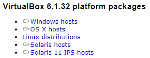
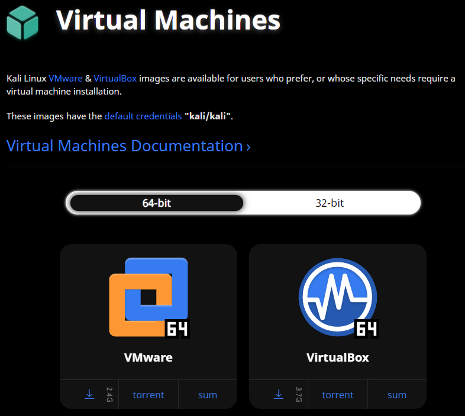
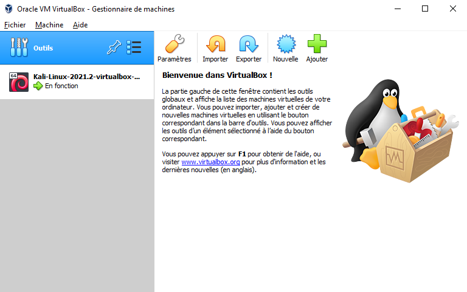
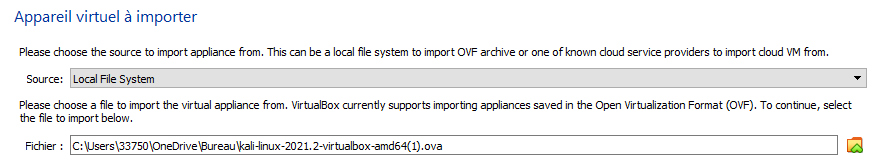
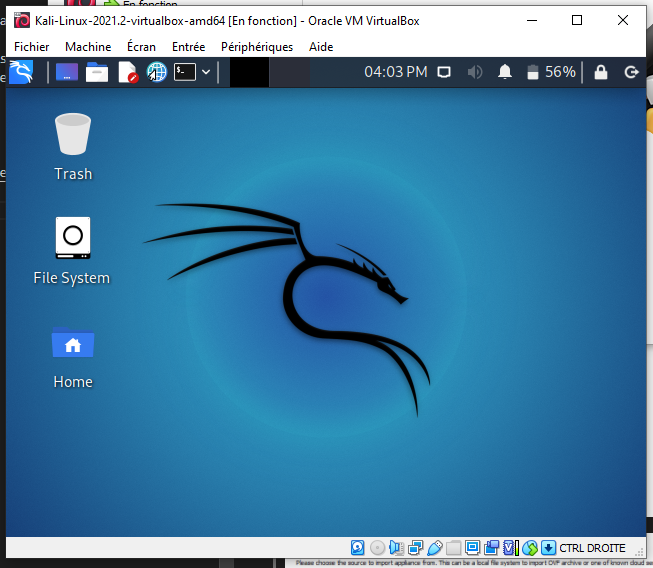

# SAE12 Machine Virtuelle

<!--Hugo Navarro 22/01/2022-->

 

> Dans ce manuel nous allons apprendre à installer une machine virtuelle, nous prendrons ici l'exemple d'un Kali Linux.

 

## **Virtual Box**

Pour installer une machine virtuelle, nous allons tout d'abord installer le logiciel `Virtual Box`.  
Voici un lien vers l'installation : https://www.virtualbox.org/wiki/Downloads

Une fois sur la page choisissez une version du logiciel selon votre OS comme suit :

> Si vous voulez améliorer la qualité des services proposés par VBox, vous pouvez aussi installer l'`Extension Pack`, il faudra juste s'assurer d'installer une version identique à votre version de VBox.

 

## **La machine virtuelle**

 

Maintenant qu'on a installé Virtual Box on peut s'occuper d'installer l'image de la machine virtuelle. Pour cela il suffit simplement de chercher sur le site internet du système d'exploitation que vous voulez émuler.

> En temps qu'exemple nous allons voir comment installer une machine virtuelle de Kali Linux.

 

On attend maintenant que l'`OVA` soit téléchargé.

> Cela peut prendre une ou plusieurs heures selon votre connexion et selon la machine virtuelle que vous voulez installer.

 

Une fois l'installation terminée il faut aller sur Virtual Box pour installer la machine virtuelle.  
Il suffit ensuite de faire `Ajouter` dans les outils du logiciel et de choisir l'image que vous venez de télécharger.

 

Plus qu'à lancer la machine et voilà ! Vous êtes sur le bureau de votre machine virtuelle fraîchement créée !

> Merci d'avoir suivi ce manuel, en espérant avoir pu vous aider au mieux. Comme d'habitude j'ai essayer de synthètiser au maximum tout en restant le plus clair possible.
